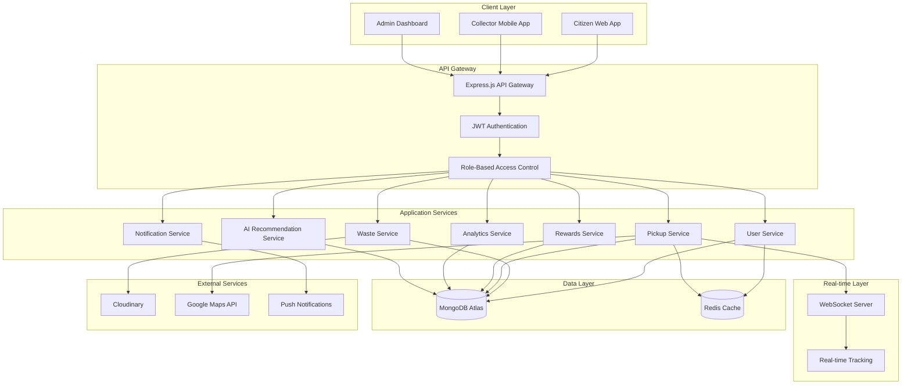

# Design Document: EcoCycle Waste Management Platform

## Overview

EcoCycle is a comprehensive MERN-stack web application that revolutionizes urban waste management through gamification and real-time tracking. The platform creates a sustainable ecosystem connecting citizens, collectors, and administrators through an intelligent rewards system powered by EcoPoints.

The system architecture follows modern full-stack JavaScript patterns, leveraging MongoDB's flexible document storage, Express.js for robust API development, React for dynamic user interfaces, and Node.js for scalable server-side operations. The platform integrates real-time communication through WebSockets, AI-powered recommendations, and third-party services for maps, file storage, and payment processing.

## Architecture

### High-Level Architecture



### Technology Stack

**Frontend:**
- React 18 with functional components and hooks
- Tailwind CSS for responsive design
- React Router for client-side routing
- Axios for HTTP requests
- Socket.io-client for real-time communication
- React Query for state management and caching

**Backend:**
- Node.js with Express.js framework
- Socket.io for WebSocket communication
- JWT for authentication with bcrypt for password hashing
- Mongoose for MongoDB object modeling
- Redis for session management and caching
- Multer for file upload handling

**Database:**
- MongoDB Atlas for primary data storage
- Redis for caching and session storage

**External Services:**
- Cloudinary for image storage and processing
- Google Maps API for navigation and location services
- Push notification services for mobile alerts

**Deployment:**
- Vercel for frontend deployment
- Render for backend deployment
- MongoDB Atlas for database hosting
- Redis Cloud for caching layer

## Components and Interfaces

### Core Components

#### User Management Component
```typescript
interface User {
  _id: ObjectId;
  email: string;
  password: string; // bcrypt hashed
  role: 'citizen' | 'collector' | 'admin';
  profile: UserProfile;
  createdAt: Date;
  updatedAt: Date;
  isActive: boolean;
}

interface UserProfile {
  firstName: string;
  lastName: string;
  phone?: string;
  addresses: Address[];
  preferences: UserPreferences;
}

interface Address {
  _id: ObjectId;
  street: string;
  city: string;
  zipCode: string;
  coordinates: {
    lat: number;
    lng: number;
  };
  isDefault: boolean;
}

interface UserPreferences {
  notifications: {
    pickup: boolean;
    rewards: boolean;
    challenges: boolean;
  };
  privacy: {
    showInLeaderboard: boolean;
    shareImpactData: boolean;
  };
}
```

#### Waste Management Component
```typescript
interface WasteLog {
  _id: ObjectId;
  citizenId: ObjectId;
  wasteType: WasteType;
  weight: number; // in kg
  photos: string[]; // Cloudinary URLs
  description?: string;
  location: Address;
  ecoPointsEarned: number;
  status: 'pending' | 'verified' | 'rejected';
  createdAt: Date;
  verifiedAt?: Date;
  verifiedBy?: ObjectId; // collector or admin
}

enum WasteType {
  PLASTIC = 'plastic',
  PAPER = 'paper',
  GLASS = 'glass',
  METAL = 'metal',
  ORGANIC = 'organic',
  ELECTRONIC = 'electronic',
  HAZARDOUS = 'hazardous'
}

interface WasteTypeConfig {
  type: WasteType;
  pointsPerKg: number;
  co2SavedPerKg: number; // in kg CO2
  description: string;
  recyclingTips: string[];
}
```

#### Pickup Management Component
```typescript
interface PickupRequest {
  _id: ObjectId;
  citizenId: ObjectId;
  wasteLogIds: ObjectId[];
  address: Address;
  scheduledTime?: Date;
  priority: 'low' | 'medium' | 'high' | 'urgent';
  status: PickupStatus;
  assignedCollectorId?: ObjectId;
  qrCode: string;
  estimatedWeight: number;
  actualWeight?: number;
  notes?: string;
  createdAt: Date;
  updatedAt: Date;
  completedAt?: Date;
}

enum PickupStatus {
  PENDING = 'pending',
  ASSIGNED = 'assigned',
  EN_ROUTE = 'en_route',
  ARRIVED = 'arrived',
  IN_PROGRESS = 'in_progress',
  COMPLETED = 'completed',
  CANCELLED = 'cancelled'
}

interface CollectionReport {
  _id: ObjectId;
  pickupRequestId: ObjectId;
  collectorId: ObjectId;
  actualWeight: number;
  wasteBreakdown: {
    type: WasteType;
    weight: number;
  }[];
  photos: string[];
  notes?: string;
  completedAt: Date;
  qrVerified: boolean;
}
```

#### EcoPoints and Rewards Component
```typescript
interface EcoPointsWallet {
  _id: ObjectId;
  citizenId: ObjectId;
  balance: number;
  totalEarned: number;
  totalSpent: number;
  transactions: EcoPointsTransaction[];
  updatedAt: Date;
}

interface EcoPointsTransaction {
  _id: ObjectId;
  type: 'earned' | 'spent' | 'bonus' | 'penalty';
  amount: number;
  description: string;
  relatedId?: ObjectId; // waste log, pickup, or reward redemption
  createdAt: Date;
}

interface Reward {
  _id: ObjectId;
  name: string;
  description: string;
  category: string;
  pointsCost: number;
  image: string;
  partnerId?: ObjectId;
  isActive: boolean;
  stock?: number;
  expiresAt?: Date;
  terms: string[];
}

interface RewardRedemption {
  _id: ObjectId;
  citizenId: ObjectId;
  rewardId: ObjectId;
  pointsSpent: number;
  status: 'pending' | 'approved' | 'fulfilled' | 'cancelled';
  redemptionCode: string;
  redeemedAt: Date;
  fulfilledAt?: Date;
}
```

#### Gamification Component
```typescript
interface Challenge {
  _id: ObjectId;
  title: string;
  description: string;
  type: 'weekly' | 'monthly' | 'special';
  target: {
    metric: 'weight' | 'pickups' | 'points' | 'streak';
    value: number;
    wasteTypes?: WasteType[];
  };
  reward: {
    points: number;
    badge?: string;
  };
  startDate: Date;
  endDate: Date;
  isActive: boolean;
  participants: ObjectId[];
}

interface UserChallenge {
  _id: ObjectId;
  citizenId: ObjectId;
  challengeId: ObjectId;
  progress: number;
  completed: boolean;
  completedAt?: Date;
  rewardClaimed: boolean;
}

interface Leaderboard {
  _id: ObjectId;
  type: 'global' | 'area' | 'challenge';
  period: 'weekly' | 'monthly' | 'all_time';
  area?: string; // zip code or city
  challengeId?: ObjectId;
  rankings: LeaderboardEntry[];
  updatedAt: Date;
}

interface LeaderboardEntry {
  citizenId: ObjectId;
  displayName: string;
  score: number;
  rank: number;
  badge?: string;
}
```

#### Analytics and Impact Component
```typescript
interface ImpactDashboard {
  _id: ObjectId;
  citizenId: ObjectId;
  totalWasteRecycled: number; // kg
  co2Saved: number; // kg CO2
  ecoPointsEarned: number;
  pickupsCompleted: number;
  currentStreak: number;
  longestStreak: number;
  wasteBreakdown: {
    type: WasteType;
    weight: number;
    percentage: number;
  }[];
  monthlyTrends: {
    month: string;
    weight: number;
    points: number;
    co2Saved: number;
  }[];
  achievements: Achievement[];
  updatedAt: Date;
}

interface Achievement {
  _id: ObjectId;
  name: string;
  description: string;
  icon: string;
  unlockedAt: Date;
  rarity: 'common' | 'rare' | 'epic' | 'legendary';
}

interface SystemAnalytics {
  _id: ObjectId;
  date: Date;
  metrics: {
    totalUsers: number;
    activeUsers: number;
    totalWasteCollected: number;
    totalPickups: number;
    totalEcoPointsIssued: number;
    averageResponseTime: number;
    userRetentionRate: number;
  };
  wasteTypeBreakdown: {
    type: WasteType;
    weight: number;
    percentage: number;
  }[];
  geographicData: {
    area: string;
    pickups: number;
    weight: number;
  }[];
}
```

#### AI Recommendation Component
```typescript
interface AIRecommendation {
  _id: ObjectId;
  citizenId: ObjectId;
  type: 'waste_reduction' | 'recycling_tip' | 'challenge_suggestion' | 'reward_suggestion';
  title: string;
  description: string;
  actionItems: string[];
  confidence: number; // 0-1
  basedOn: {
    wastePatterns: boolean;
    seasonalTrends: boolean;
    userBehavior: boolean;
    communityData: boolean;
  };
  createdAt: Date;
  viewedAt?: Date;
  actionTaken?: boolean;
}

interface UserBehaviorProfile {
  _id: ObjectId;
  citizenId: ObjectId;
  wastePatterns: {
    preferredTypes: WasteType[];
    averageWeight: number;
    frequency: number; // pickups per week
    seasonalVariations: {
      season: string;
      multiplier: number;
    }[];
  };
  engagementMetrics: {
    loginFrequency: number;
    challengeParticipation: number;
    rewardRedemptionRate: number;
    responseToRecommendations: number;
  };
  preferences: {
    preferredPickupTimes: string[];
    communicationStyle: 'brief' | 'detailed' | 'visual';
    motivationFactors: string[];
  };
  updatedAt: Date;
}
```

### API Interfaces

#### Authentication API
```typescript
interface AuthAPI {
  POST /api/auth/register: (userData: RegisterRequest) => AuthResponse;
  POST /api/auth/login: (credentials: LoginRequest) => AuthResponse;
  POST /api/auth/refresh: (refreshToken: string) => AuthResponse;
  POST /api/auth/logout: () => void;
  POST /api/auth/forgot-password: (email: string) => void;
  POST /api/auth/reset-password: (token: string, newPassword: string) => void;
}

interface RegisterRequest {
  email: string;
  password: string;
  firstName: string;
  lastName: string;
  role: 'citizen' | 'collector';
  address: Address;
}

interface LoginRequest {
  email: string;
  password: string;
}

interface AuthResponse {
  user: User;
  accessToken: string;
  refreshToken: string;
  expiresIn: number;
}
```

#### Waste Management API
```typescript
interface WasteAPI {
  POST /api/waste/log: (wasteData: WasteLogRequest) => WasteLog;
  GET /api/waste/logs: (filters: WasteLogFilters) => PaginatedResponse<WasteLog>;
  GET /api/waste/logs/:id: () => WasteLog;
  PUT /api/waste/logs/:id: (updates: Partial<WasteLog>) => WasteLog;
  DELETE /api/waste/logs/:id: () => void;
  GET /api/waste/types: () => WasteTypeConfig[];
}

interface WasteLogRequest {
  wasteType: WasteType;
  weight: number;
  photos: File[];
  description?: string;
  addressId: ObjectId;
}

interface WasteLogFilters {
  citizenId?: ObjectId;
  wasteType?: WasteType;
  status?: string;
  dateFrom?: Date;
  dateTo?: Date;
  page: number;
  limit: number;
}
```

#### Pickup Management API
```typescript
interface PickupAPI {
  POST /api/pickups/request: (pickupData: PickupRequestData) => PickupRequest;
  GET /api/pickups: (filters: PickupFilters) => PaginatedResponse<PickupRequest>;
  GET /api/pickups/:id: () => PickupRequest;
  PUT /api/pickups/:id/assign: (collectorId: ObjectId) => PickupRequest;
  PUT /api/pickups/:id/status: (status: PickupStatus) => PickupRequest;
  POST /api/pickups/:id/verify: (qrCode: string) => VerificationResponse;
  POST /api/pickups/:id/complete: (reportData: CollectionReportData) => CollectionReport;
  GET /api/pickups/:id/track: () => TrackingData;
}

interface PickupRequestData {
  wasteLogIds: ObjectId[];
  addressId: ObjectId;
  scheduledTime?: Date;
  notes?: string;
}

interface TrackingData {
  pickupId: ObjectId;
  status: PickupStatus;
  collectorLocation?: {
    lat: number;
    lng: number;
    timestamp: Date;
  };
  estimatedArrival?: Date;
  updates: StatusUpdate[];
}
```

### Real-time Communication

#### WebSocket Events
```typescript
interface WebSocketEvents {
  // Client to Server
  'join-room': (roomId: string) => void;
  'leave-room': (roomId: string) => void;
  'update-location': (location: LocationUpdate) => void;
  'pickup-status-change': (pickupId: ObjectId, status: PickupStatus) => void;
  
  // Server to Client
  'pickup-assigned': (pickup: PickupRequest) => void;
  'pickup-status-updated': (pickup: PickupRequest) => void;
  'collector-location-updated': (location: CollectorLocation) => void;
  'notification': (notification: Notification) => void;
  'challenge-completed': (challenge: UserChallenge) => void;
  'leaderboard-updated': (leaderboard: Leaderboard) => void;
}

interface LocationUpdate {
  collectorId: ObjectId;
  lat: number;
  lng: number;
  timestamp: Date;
}

interface CollectorLocation {
  collectorId: ObjectId;
  pickupId: ObjectId;
  lat: number;
  lng: number;
  estimatedArrival: Date;
}
```

## Data Models

### Database Schema Design

The MongoDB database uses a document-oriented approach with the following collections:

#### Users Collection
```javascript
{
  _id: ObjectId,
  email: String (unique, indexed),
  password: String, // bcrypt hashed
  role: String (enum: ['citizen', 'collector', 'admin']),
  profile: {
    firstName: String,
    lastName: String,
    phone: String,
    addresses: [{
      _id: ObjectId,
      street: String,
      city: String,
      zipCode: String (indexed),
      coordinates: {
        type: "Point",
        coordinates: [Number, Number] // [lng, lat] - GeoJSON format
      },
      isDefault: Boolean
    }],
    preferences: {
      notifications: {
        pickup: Boolean,
        rewards: Boolean,
        challenges: Boolean
      },
      privacy: {
        showInLeaderboard: Boolean,
        shareImpactData: Boolean
      }
    }
  },
  isActive: Boolean,
  createdAt: Date,
  updatedAt: Date
}
```

#### Waste Logs Collection
```javascript
{
  _id: ObjectId,
  citizenId: ObjectId (indexed),
  wasteType: String (enum, indexed),
  weight: Number,
  photos: [String], // Cloudinary URLs
  description: String,
  location: {
    addressId: ObjectId,
    coordinates: {
      type: "Point",
      coordinates: [Number, Number]
    }
  },
  ecoPointsEarned: Number,
  status: String (enum: ['pending', 'verified', 'rejected']),
  createdAt: Date (indexed),
  verifiedAt: Date,
  verifiedBy: ObjectId
}
```

#### Pickup Requests Collection
```javascript
{
  _id: ObjectId,
  citizenId: ObjectId (indexed),
  wasteLogIds: [ObjectId],
  address: {
    street: String,
    city: String,
    zipCode: String,
    coordinates: {
      type: "Point",
      coordinates: [Number, Number]
    }
  },
  scheduledTime: Date,
  priority: String (enum: ['low', 'medium', 'high', 'urgent']),
  status: String (enum, indexed),
  assignedCollectorId: ObjectId (indexed),
  qrCode: String (unique),
  estimatedWeight: Number,
  actualWeight: Number,
  notes: String,
  createdAt: Date (indexed),
  updatedAt: Date,
  completedAt: Date
}
```

#### EcoPoints Wallets Collection
```javascript
{
  _id: ObjectId,
  citizenId: ObjectId (unique, indexed),
  balance: Number,
  totalEarned: Number,
  totalSpent: Number,
  transactions: [{
    _id: ObjectId,
    type: String (enum: ['earned', 'spent', 'bonus', 'penalty']),
    amount: Number,
    description: String,
    relatedId: ObjectId,
    createdAt: Date
  }],
  updatedAt: Date
}
```

### Database Indexing Strategy

```javascript
// Users Collection Indexes
db.users.createIndex({ "email": 1 }, { unique: true })
db.users.createIndex({ "role": 1 })
db.users.createIndex({ "profile.addresses.zipCode": 1 })
db.users.createIndex({ "profile.addresses.coordinates": "2dsphere" })

// Waste Logs Collection Indexes
db.wastelogs.createIndex({ "citizenId": 1 })
db.wastelogs.createIndex({ "wasteType": 1 })
db.wastelogs.createIndex({ "createdAt": -1 })
db.wastelogs.createIndex({ "status": 1 })
db.wastelogs.createIndex({ "location.coordinates": "2dsphere" })

// Pickup Requests Collection Indexes
db.pickuprequests.createIndex({ "citizenId": 1 })
db.pickuprequests.createIndex({ "assignedCollectorId": 1 })
db.pickuprequests.createIndex({ "status": 1 })
db.pickuprequests.createIndex({ "createdAt": -1 })
db.pickuprequests.createIndex({ "address.coordinates": "2dsphere" })
db.pickuprequests.createIndex({ "qrCode": 1 }, { unique: true })

// EcoPoints Wallets Collection Indexes
db.ecopointswallets.createIndex({ "citizenId": 1 }, { unique: true })
db.ecopointswallets.createIndex({ "transactions.createdAt": -1 })

// Compound Indexes for Common Queries
db.wastelogs.createIndex({ "citizenId": 1, "createdAt": -1 })
db.pickuprequests.createIndex({ "status": 1, "createdAt": -1 })
db.pickuprequests.createIndex({ "assignedCollectorId": 1, "status": 1 })
```

### Data Validation and Constraints

```javascript
// User Schema Validation
const userSchema = {
  $jsonSchema: {
    bsonType: "object",
    required: ["email", "password", "role", "profile"],
    properties: {
      email: {
        bsonType: "string",
        pattern: "^[a-zA-Z0-9._%+-]+@[a-zA-Z0-9.-]+\\.[a-zA-Z]{2,}$"
      },
      password: {
        bsonType: "string",
        minLength: 60, // bcrypt hash length
        maxLength: 60
      },
      role: {
        enum: ["citizen", "collector", "admin"]
      },
      profile: {
        bsonType: "object",
        required: ["firstName", "lastName"],
        properties: {
          firstName: { bsonType: "string", minLength: 1, maxLength: 50 },
          lastName: { bsonType: "string", minLength: 1, maxLength: 50 },
          phone: { bsonType: "string", pattern: "^\\+?[1-9]\\d{1,14}$" }
        }
      }
    }
  }
}

// Waste Log Schema Validation
const wasteLogSchema = {
  $jsonSchema: {
    bsonType: "object",
    required: ["citizenId", "wasteType", "weight", "status"],
    properties: {
      weight: {
        bsonType: "number",
        minimum: 0.1,
        maximum: 1000
      },
      wasteType: {
        enum: ["plastic", "paper", "glass", "metal", "organic", "electronic", "hazardous"]
      },
      status: {
        enum: ["pending", "verified", "rejected"]
      },
      ecoPointsEarned: {
        bsonType: "number",
        minimum: 0
      }
    }
  }
}
```

Now I need to use the prework tool to analyze the acceptance criteria before writing the Correctness Properties section:

<function_calls>
<invoke name="prework">
<parameter name="featureName">ecocycle-platform

## Correctness Properties

*A property is a characteristic or behavior that should hold true across all valid executions of a system-essentially, a formal statement about what the system should do. Properties serve as the bridge between human-readable specifications and machine-verifiable correctness guarantees.*

### Property Reflection

After analyzing all acceptance criteria, I identified several areas where properties can be consolidated to eliminate redundancy:

**Authentication and Security Properties**: Multiple criteria about password hashing, JWT tokens, HTTPS enforcement, and access control can be combined into comprehensive security properties.

**Notification Properties**: Various notification requirements (pickup status, rewards, challenges, proximity) can be consolidated into general notification delivery and preference enforcement properties.

**Data Persistence Properties**: Multiple requirements about maintaining transaction history, audit logs, and status history can be combined into comprehensive data integrity properties.

**Real-time Update Properties**: Several criteria about immediate updates (wallet balance, dashboard metrics, status changes) can be consolidated into general real-time synchronization properties.

**Validation Properties**: Multiple validation requirements (waste data, scheduling, balance checks) can be combined into comprehensive input validation properties.

### Core Correctness Properties

**Property 1: Password Security**
*For any* user registration, the stored password should be bcrypt hashed and never stored in plain text
**Validates: Requirements 1.1**

**Property 2: JWT Authentication**
*For any* successful login, a valid JWT token should be issued containing the correct user role and expiration
**Validates: Requirements 1.2**

**Property 3: Profile Management Persistence**
*For any* citizen profile update, all changes should be persisted correctly and retrievable in subsequent queries
**Validates: Requirements 1.3**

**Property 4: HTTPS Enforcement**
*For any* authentication endpoint request, HTTP requests should be rejected or redirected to HTTPS
**Validates: Requirements 1.4**

**Property 5: Secure Error Messages**
*For any* authentication failure, error messages should not reveal sensitive system information or user existence
**Validates: Requirements 1.5**

**Property 6: Waste Log Data Integrity**
*For any* waste log entry, all required fields (type, weight) should be stored correctly and optional fields (photos, description) should be preserved when provided
**Validates: Requirements 2.1**

**Property 7: Photo Storage Integration**
*For any* photo upload, the image should be stored in Cloudinary and a valid URL should be returned and associated with the waste log
**Validates: Requirements 2.2**

**Property 8: EcoPoints Calculation Accuracy**
*For any* waste log entry, EcoPoints should be calculated correctly based on waste type and weight using the defined conversion rates
**Validates: Requirements 2.3**

**Property 9: Waste Data Validation**
*For any* invalid waste data (negative weight, invalid type, missing required fields), the entry should be rejected with appropriate error messages
**Validates: Requirements 2.4**

**Property 10: Real-time Dashboard Updates**
*For any* completed waste log, the citizen's impact dashboard should reflect the new data immediately
**Validates: Requirements 2.5**

**Property 11: Pickup Request Processing**
*For any* pickup request, both on-demand and scheduled options should be processed correctly with appropriate validation
**Validates: Requirements 3.1**

**Property 12: Scheduling Validation**
*For any* scheduled pickup request, time slot availability should be validated before acceptance
**Validates: Requirements 3.2**

**Property 13: Priority Queue Ordering**
*For any* set of pickup requests with different priorities, the collector queue should maintain correct priority ordering
**Validates: Requirements 3.3**

**Property 14: Pickup Request Notifications**
*For any* pickup request creation or modification, appropriate notifications should be sent to all relevant parties
**Validates: Requirements 3.4, 3.5**

**Property 15: Pickup Status Management**
*For any* pickup status change, the status should be updated correctly and citizens should be notified appropriately
**Validates: Requirements 4.1, 4.3, 4.5**

**Property 16: Real-time Location Tracking**
*For any* active pickup with an en-route collector, citizens should receive location updates within the specified time limits
**Validates: Requirements 4.2**

**Property 17: Status History Persistence**
*For any* pickup request, complete status change history should be maintained and accessible for reference
**Validates: Requirements 4.4**

**Property 18: Mobile Interface Optimization**
*For any* collector dashboard access, the interface should render correctly on mobile devices with full functionality
**Validates: Requirements 5.1, 5.3**

**Property 19: Navigation Integration**
*For any* pickup selection by a collector, Google Maps integration should provide correct navigation functionality
**Validates: Requirements 5.2**

**Property 20: Offline Data Caching**
*For any* collector operating offline, essential pickup data should remain accessible from cache
**Validates: Requirements 5.4**

**Property 21: QR Code Uniqueness**
*For any* pickup initiation, a unique QR code should be generated that doesn't conflict with existing codes
**Validates: Requirements 6.1**

**Property 22: QR Verification Security**
*For any* QR code verification attempt, successful verification should enable completion workflow while failed verification should prevent completion and log the attempt
**Validates: Requirements 6.3, 6.4**

**Property 23: Collection Report Immutability**
*For any* verified pickup, the collection report should be created and remain immutable after creation
**Validates: Requirements 6.5**

**Property 24: EcoPoints Wallet Consistency**
*For any* EcoPoints transaction (earning or spending), wallet balance should be updated immediately and negative balances should be prevented
**Validates: Requirements 7.1, 7.2**

**Property 25: Transaction History Completeness**
*For any* citizen's wallet operations, complete transaction history should be maintained with all details preserved
**Validates: Requirements 7.3**

**Property 26: Wallet Data Consistency**
*For any* wallet transaction, all related records should remain consistent across the system
**Validates: Requirements 7.4**

**Property 27: Real-time Wallet APIs**
*For any* wallet API request, current balance and transaction data should be returned accurately
**Validates: Requirements 7.5**

**Property 28: Rewards Store Display**
*For any* citizen browsing the rewards store, all available items should be displayed with correct EcoPoints pricing
**Validates: Requirements 8.1**

**Property 29: Reward Redemption Validation**
*For any* reward redemption attempt, sufficient EcoPoints balance should be verified before processing
**Validates: Requirements 8.2**

**Property 30: Redemption Transaction Processing**
*For any* successful reward redemption, EcoPoints should be deducted and a redemption record should be created
**Validates: Requirements 8.3**

**Property 31: Partner Integration Reliability**
*For any* reward redemption, appropriate integration calls should be made to partner systems for fulfillment
**Validates: Requirements 8.4**

**Property 32: Redemption Notifications**
*For any* reward redemption, confirmation notifications should be sent to the citizen
**Validates: Requirements 8.5**

**Property 33: Impact Dashboard Accuracy**
*For any* citizen dashboard access, CO₂ saved calculations and recycling statistics should be displayed accurately based on their waste logs
**Validates: Requirements 9.1, 9.2**

**Property 34: Historical Impact Visualization**
*For any* citizen's impact data request, historical trends should be calculated and displayed correctly
**Validates: Requirements 9.3**

**Property 35: Milestone Processing**
*For any* citizen reaching an impact milestone, bonus EcoPoints should be awarded and congratulatory notifications should be sent
**Validates: Requirements 9.4**

**Property 36: Environmental Conversion Accuracy**
*For any* impact metric calculation, verified environmental conversion factors should be used consistently
**Validates: Requirements 9.5**

**Property 37: Leaderboard Filtering**
*For any* leaderboard request with area filters, rankings should be displayed correctly for the specified geographic area
**Validates: Requirements 10.1**

**Property 38: Challenge Management**
*For any* challenge creation, weekly and monthly challenges should be configured with correct goals and timeframes
**Validates: Requirements 10.3**

**Property 39: Challenge Completion Rewards**
*For any* completed challenge, bonus EcoPoints should be awarded and achievements should be updated correctly
**Validates: Requirements 10.4**

**Property 40: Leaderboard Privacy Protection**
*For any* leaderboard display, user privacy settings should be respected and private information should not be exposed
**Validates: Requirements 10.5**

**Property 41: Comprehensive Notification System**
*For any* system event requiring notification (status changes, proximity alerts, rewards), notifications should be sent to the correct recipients based on their preferences
**Validates: Requirements 11.1, 11.2, 11.5**

**Property 42: Notification Preference Management**
*For any* user notification preference update, the changes should be applied correctly to future notifications
**Validates: Requirements 11.3**

**Property 43: Admin Search Functionality**
*For any* admin user search with filters, comprehensive and accurate results should be returned
**Validates: Requirements 12.1**

**Property 44: Admin Audit Logging**
*For any* admin modification to user accounts, all changes should be logged completely for audit purposes
**Validates: Requirements 12.2**

**Property 45: Waste Submission Moderation**
*For any* pending waste submission, admins should be able to view and moderate with appropriate actions available
**Validates: Requirements 12.3**

**Property 46: Admin Authorization Enforcement**
*For any* admin action attempt, proper authorization and access controls should be enforced based on user roles
**Validates: Requirements 12.4, 12.5**

**Property 47: Analytics Data Accuracy**
*For any* admin analytics request, city-wide statistics and real-time reports should be generated accurately from current system data
**Validates: Requirements 13.1, 13.2**

**Property 48: KPI Tracking Completeness**
*For any* system operation, relevant key performance indicators should be tracked and updated correctly
**Validates: Requirements 13.4**

**Property 49: Analytics Data Export**
*For any* analytics data export request, data should be provided in standard formats suitable for external analysis
**Validates: Requirements 13.5**

**Property 50: Partnership Management**
*For any* partnership or reward catalog update, partner information should be maintained correctly and remain consistent
**Validates: Requirements 14.1, 14.5**

**Property 51: Campaign Content Management**
*For any* awareness campaign creation or publication, content should be managed correctly and distributed to appropriate user segments
**Validates: Requirements 14.2, 14.3**

**Property 52: Campaign Effectiveness Tracking**
*For any* active campaign, engagement metrics should be tracked accurately to measure effectiveness
**Validates: Requirements 14.4**

**Property 53: AI Recommendation Analysis**
*For any* citizen requesting recommendations, the AI system should analyze their waste logging patterns and provide personalized suggestions
**Validates: Requirements 15.1, 15.2**

**Property 54: AI Learning and Adaptation**
*For any* user behavior change or feedback, the AI recommendation system should adapt suggestions accordingly and improve over time
**Validates: Requirements 15.3, 15.4**

**Property 55: Recommendation Presentation**
*For any* generated recommendation, it should be presented in an engaging and actionable format for the citizen
**Validates: Requirements 15.5**

**Property 56: Data Encryption Compliance**
*For any* sensitive data storage or transmission, appropriate encryption should be applied both at rest and in transit
**Validates: Requirements 16.1**

**Property 57: Security Access Logging**
*For any* user data access attempt, the access should be logged correctly for security monitoring purposes
**Validates: Requirements 16.2**

**Property 58: Role-Based Access Control**
*For any* data operation attempt, role-based access controls should be enforced correctly based on user permissions
**Validates: Requirements 16.3**

**Property 59: Data Breach Response**
*For any* detected data breach, affected users and authorities should be notified immediately according to protocols
**Validates: Requirements 16.4**

**Property 60: Data Protection Compliance**
*For any* user data export request, the system should provide data in compliance with data protection regulations
**Validates: Requirements 16.5**

**Property 61: Automated Backup Execution**
*For any* scheduled backup period, automated backups of critical data should be performed successfully
**Validates: Requirements 17.4**

**Property 62: Performance Monitoring and Recovery**
*For any* performance degradation event, administrators should be alerted and recovery procedures should be initiated
**Validates: Requirements 17.5**

**Property 63: Responsive Design Adaptation**
*For any* screen size or device type, the interface should adapt correctly while maintaining full functionality
**Validates: Requirements 18.1**

**Property 64: Accessibility Standards Compliance**
*For any* interface element, WCAG 2.1 accessibility standards should be met for inclusive design
**Validates: Requirements 18.2**

**Property 65: Accessibility Feature Support**
*For any* accessibility feature usage (keyboard navigation, screen readers), full functionality should be maintained across all features
**Validates: Requirements 18.4, 18.5**

## Error Handling

### Error Classification and Response Strategy

The EcoCycle system implements a comprehensive error handling strategy that categorizes errors into distinct types with appropriate response mechanisms:

#### Client Errors (4xx)
- **Authentication Errors (401)**: Invalid credentials, expired tokens, or missing authentication
- **Authorization Errors (403)**: Insufficient permissions for requested operations
- **Validation Errors (400)**: Invalid input data, missing required fields, or constraint violations
- **Resource Not Found (404)**: Requested resources that don't exist or are inaccessible

#### Server Errors (5xx)
- **Internal Server Errors (500)**: Unexpected application failures or unhandled exceptions
- **Service Unavailable (503)**: External service dependencies (Cloudinary, Google Maps) unavailable
- **Database Errors (500)**: MongoDB connection issues or query failures
- **Rate Limiting (429)**: API rate limits exceeded

#### Business Logic Errors
- **Insufficient Balance**: EcoPoints balance too low for redemption or transaction
- **Scheduling Conflicts**: Pickup time slots unavailable or conflicting
- **QR Verification Failures**: Invalid or expired QR codes for pickup verification
- **Duplicate Operations**: Attempts to create duplicate resources or perform idempotent operations

### Error Response Format

All API errors follow a consistent JSON structure:

```json
{
  "error": {
    "code": "ERROR_CODE",
    "message": "Human-readable error description",
    "details": {
      "field": "specific field that caused the error",
      "value": "invalid value provided",
      "constraint": "validation rule that was violated"
    },
    "timestamp": "2024-01-15T10:30:00Z",
    "requestId": "unique-request-identifier"
  }
}
```

### Error Handling Patterns

#### Graceful Degradation
- **Offline Mode**: Collectors can continue essential operations with cached data when network connectivity is lost
- **External Service Failures**: Photo uploads fall back to local storage when Cloudinary is unavailable
- **Real-time Features**: WebSocket failures gracefully fall back to polling mechanisms

#### Retry Mechanisms
- **Exponential Backoff**: Failed external API calls are retried with increasing delays
- **Circuit Breaker**: Repeated failures to external services trigger circuit breaker to prevent cascade failures
- **Queue Processing**: Failed background jobs are retried with configurable limits

#### Data Consistency
- **Transaction Rollback**: Database operations are wrapped in transactions with automatic rollback on failures
- **Compensating Actions**: Failed multi-step operations trigger compensating actions to maintain consistency
- **Event Sourcing**: Critical operations are logged as events to enable recovery and audit trails

### Monitoring and Alerting

#### Error Tracking
- **Centralized Logging**: All errors are logged with structured data for analysis
- **Error Aggregation**: Similar errors are grouped and tracked for pattern identification
- **Performance Impact**: Error rates are correlated with performance metrics

#### Alert Thresholds
- **Critical Errors**: Immediate alerts for authentication failures, data corruption, or security breaches
- **Service Degradation**: Alerts when error rates exceed 5% of total requests
- **External Dependencies**: Alerts when external service failures exceed 10% of requests

## Testing Strategy

### Dual Testing Approach

The EcoCycle platform employs a comprehensive testing strategy that combines unit testing and property-based testing to ensure both specific functionality and universal correctness properties.

#### Unit Testing Focus
Unit tests validate specific examples, edge cases, and error conditions:

- **Authentication Edge Cases**: Test specific scenarios like expired tokens, malformed credentials, and edge cases in password validation
- **Integration Points**: Test specific interactions between components, such as Cloudinary upload failures or Google Maps API responses
- **Error Conditions**: Test specific error scenarios like network timeouts, database connection failures, and invalid input formats
- **Business Logic Examples**: Test specific calculations like EcoPoints for different waste types and weights

#### Property-Based Testing Focus
Property tests validate universal properties across all inputs:

- **Universal Properties**: Test properties that should hold for all valid inputs, such as password hashing consistency and wallet balance integrity
- **Comprehensive Input Coverage**: Use randomized inputs to test system behavior across the entire input space
- **Invariant Preservation**: Test that system invariants are maintained regardless of operation sequence
- **Round-trip Properties**: Test serialization/deserialization, API request/response cycles, and data persistence

### Property-Based Testing Configuration

The system uses **fast-check** for JavaScript/TypeScript property-based testing with the following configuration:

- **Minimum 100 iterations** per property test to ensure comprehensive coverage
- **Seed-based reproducibility** for consistent test results across environments
- **Shrinking enabled** to find minimal failing examples when tests fail
- **Custom generators** for domain-specific data types (waste types, coordinates, user roles)

Each property test includes a comment tag referencing its design document property:
```javascript
// Feature: ecocycle-platform, Property 8: EcoPoints Calculation Accuracy
```

### Testing Pyramid Structure

#### Unit Tests (70% of test suite)
- Component-level tests for React components
- Service-level tests for business logic
- Repository-level tests for data access
- Utility function tests for calculations and validations

#### Integration Tests (20% of test suite)
- API endpoint tests with real database connections
- External service integration tests with mocked responses
- WebSocket communication tests
- Authentication and authorization flow tests

#### Property-Based Tests (10% of test suite)
- Universal correctness properties from design document
- Cross-component invariant tests
- Data consistency and integrity tests
- Security property validation tests

### Test Environment Configuration

#### Development Testing
- **Local MongoDB**: In-memory MongoDB for fast test execution
- **Mocked External Services**: Cloudinary and Google Maps APIs mocked for consistent testing
- **Test Data Factories**: Automated generation of test data using factories and builders
- **Parallel Execution**: Tests run in parallel for faster feedback cycles

#### Continuous Integration
- **Containerized Testing**: Tests run in Docker containers for environment consistency
- **Database Seeding**: Automated database setup and teardown for each test run
- **Coverage Reporting**: Code coverage tracking with minimum 80% threshold
- **Performance Testing**: Automated performance regression testing

#### Staging Environment
- **End-to-End Testing**: Full user journey testing with real external services
- **Load Testing**: Performance testing under realistic load conditions
- **Security Testing**: Automated security vulnerability scanning
- **Accessibility Testing**: Automated WCAG compliance verification

### Test Data Management

#### Data Generation Strategies
- **Property-Based Generators**: Custom generators for domain objects (users, waste logs, pickups)
- **Realistic Test Data**: Generated data that reflects real-world usage patterns
- **Edge Case Coverage**: Specific generators for boundary conditions and edge cases
- **Privacy-Safe Data**: All test data uses synthetic information to protect privacy

#### Test Database Management
- **Isolated Test Databases**: Each test suite uses isolated database instances
- **Transactional Testing**: Database changes are rolled back after each test
- **Seed Data Management**: Consistent seed data for integration and E2E tests
- **Data Cleanup**: Automated cleanup of test data to prevent interference

This comprehensive testing strategy ensures that the EcoCycle platform maintains high quality, reliability, and correctness across all features while providing fast feedback to developers and comprehensive coverage of both specific scenarios and universal system properties.